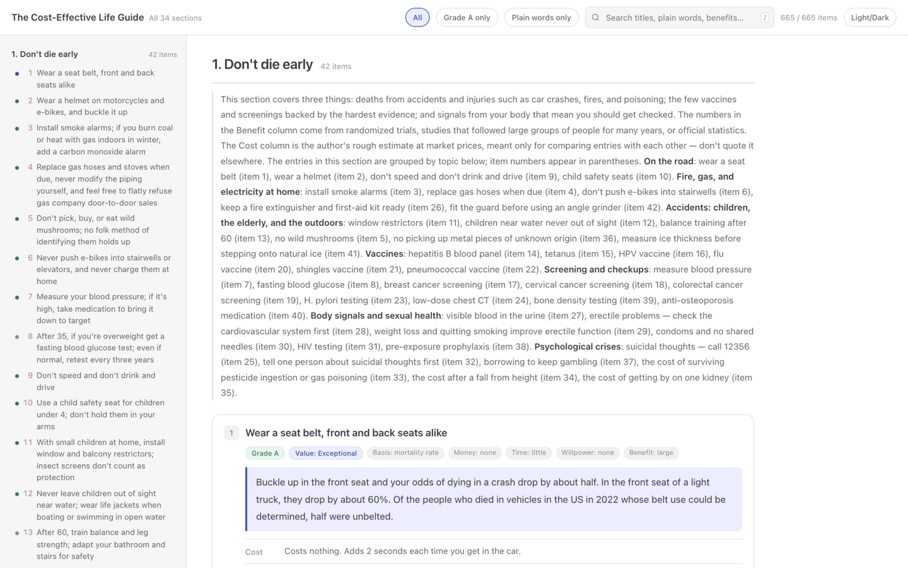
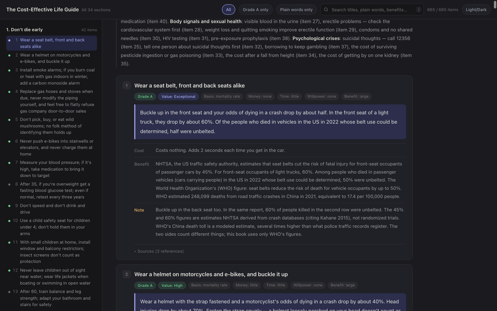
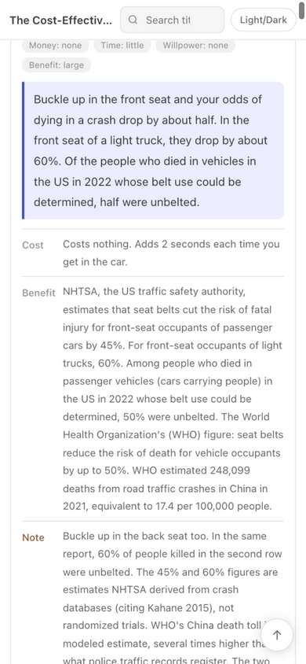

<div align="center">

# 📖 The Cost-Effective Life Guide

### *English Edition* · 高性价比人生指南

**665 life decisions, ranked by value for money — each one graded by evidence, priced, and cited.**

Stop guessing what's worth your time, money, and willpower. Every suggestion in this book
tells you exactly **what it costs, what you get back, and how hard the evidence is** —
backed only by peer-reviewed papers and official documents.

[](https://unlicense.org/)
[](#-credits--acknowledgements)
[](#-whats-inside)
[](#-whats-inside)
[](#-whats-inside)
[](#-features)

### **[📖 Read it online →](https://turbsmcgurk.github.io/how-to-live-better/)**

**[📥 Download for offline](https://raw.githubusercontent.com/turbsmcgurk/how-to-live-better/main/index.html)** ·
**[🗂 What's inside](#-whats-inside)** ·
**[🙏 Credits](#-credits--acknowledgements)**



</div>

---

## 💡 Why this book is different

Most life advice is vibes. This book is arithmetic.

Every one of the **665 suggestions** is scored on a simple question: *how much do you give up,
and how much do you get back?* Entries are then sorted by that value-for-money ratio, so the
cheapest, highest-impact actions — buckling your seat belt, measuring your blood pressure,
installing smoke alarms — float to the top, and expensive low-yield fads sink.

And because "studies show" has become a synonym for "trust me," each entry carries:

- 🅰 **An evidence grade (A / B / C)** — how solid the research actually is
- 💬 **A "plain words" block** — the key statistic restated in everyday language, no statistics degree required
- 🔗 **Original sources** — 1,653 outbound links to journal papers, national standards, and official documents

The original book is written in Chinese and focused on life in China — with Chinese prices in
yuan, national hotlines, and regulations — and this edition preserves all of that faithfully.

## ✨ Features

| | |
|---|---|
| 🗂 **One file, zero setup** | The whole book is a single `index.html`. No CDN, no web fonts, no network calls — download it once and it works forever, even offline. |
| 🔎 **Instant search** | Full-text search across every title, plain-words block, and benefit, with highlighted results. Press <kbd>/</kbd> to jump to the search box. |
| 🅰 **Filters** | Show only **Grade A** evidence, or only the **plain-words** blocks when you want the 30-second version. |
| 🧭 **Value-tinted table of contents** | Every entry in the sidebar carries a color dot for its value-for-money tier, synced to your scroll position. |
| 📱 **Built for phones** | The search box gets its own row, the header collapses as you scroll, and a back-to-top button appears when you need it. |
| 🌗 **Light & dark themes** | Follows your system preference; your choice is remembered. |
| 🖨 **Print-ready** | Print styles included — sources expand automatically on paper. |

<table>
  <tr>
    <td align="center"><br><sub><b>Dark mode</b> — badges, evidence, cost & benefit, cited sources</sub></td>
    <td align="center"><br><sub><b>Mobile</b> — the same entry on a phone</sub></td>
  </tr>
</table>

## 🗂 What's inside

**34 sections · 665 suggestions**, from "don't die" basics to life's fine print:

| # | Section | # | Section |
|---|---|---|---|
| 1 | Don't die early | 18 | Is Raising a Kid Cost-Effective? |
| 2 | Don't die slowly | 19 | Employment, Departure, and Work Injuries |
| 3 | Don't waste energy | 20 | Caring for a Newborn |
| 4 | Don't waste time | 21 | Going Abroad, Travel, and Safety Overseas |
| 5 | Don't waste money | 22 | How to Unwind: Entertainment Venues and Stress Relief |
| 6 | The Don't List | 23 | Which Skills Are Worth Learning |
| 7 | How to live when you have no money | 24 | Medical Care: How to Spend Less and Avoid Detours |
| 8 | Don't get yourself implicated: legal and property safety | 25 | What to Handle After Someone Dies |
| 9 | Legal red lines ordinary people can easily cross | 26 | Building a Website or Platform: Licenses, Filing, and Servers |
| 10 | Whether dating and marriage are worth it | 27 | Pregnancy and Childbirth: From a Positive Test to Discharge and Paperwork |
| 11 | Red lines programmers and tech workers can easily cross | 28 | Don't Wreck Your Body for Your Looks |
| 12 | Startups and business: don't lose the family fortune | 29 | After a Major Blow |
| 13 | Emergencies: what to do first | 30 | School-Age Children |
| 14 | Account and information security | 31 | Your Options After Turning Eighteen |
| 15 | Renting and buying a home | 32 | Studying Abroad: Status, Working, Insurance, and Credential Recognition Back Home |
| 16 | Living with a chronic illness | 33 | How to Live After a Disability |
| 17 | When there are elderly at home | 34 | Don't Let Your Home Medicine Cabinet Hurt You |

## 🚀 How to read it

**Online (easiest) —**
Open **[turbsmcgurk.github.io/how-to-live-better/](https://turbsmcgurk.github.io/how-to-live-better/)** in any browser, on any device.
It's rebuilt automatically whenever the upstream book changes, so it's always the latest version.

**Offline —**
[Download `index.html`](https://raw.githubusercontent.com/turbsmcgurk/how-to-live-better/main/index.html) (right-click → *Save link as…*) and double-click it.
The whole book is one self-contained file, so it works forever without internet.

**On a phone —**
Bookmark the online link or add it to your home screen. To read offline, send the downloaded
file to yourself (AirDrop, chat app, cloud drive) and open it in your browser.

**In Chinese —**
The original Chinese edition has its own hosted reader at
[cdyforever.github.io/how-to-live-better](https://cdyforever.github.io/how-to-live-better/).

## 🔄 Staying up to date

The upstream book gains new entries almost daily. This repository ships a GitHub Action
(`.github/workflows/rebuild.yml`) that pulls the upstream, re-renders the English page,
and commits only when something changed — daily at 06:00 Beijing time. Each commit
redeploys the [online reader](https://turbsmcgurk.github.io/how-to-live-better/) automatically, so there's nothing to do by hand.

To rebuild manually:

```bash
git clone --depth 1 https://github.com/eternity4719/HowToLiveBetter.git /tmp/upstream
python build.py all -o index.html --repo /tmp/upstream   # all 34 sections
python build.py 1 2 16 --repo /tmp/upstream              # or just a few
```

The source directory can also be set with the `HLTB_REPO` environment variable.

## 🙏 Credits & acknowledgements

This English edition exists only because of the original work — all content, research,
grading, and curation belong to it:

> ### [HowToLiveBetter](https://github.com/eternity4719/HowToLiveBetter) · 《高性价比人生指南》
> curated by **[eternity4719](https://github.com/eternity4719)** and its contributors,
> with an online reader maintained by **[cdyforever](https://github.com/cdyforever)**.

**If you find this book useful, please go star the
[original repository](https://github.com/eternity4719/HowToLiveBetter) —
that's where the real work happens.**

This repository contributes no new content of its own. It is a faithful **English
translation** of the original's rendered reading page: the 34 sections, all 665 entries,
their evidence grades and value-for-money tiers are the original author's; the translation
adds nothing and omits nothing.

## ⚖️ License

The original book is released under the [**Unlicense**](https://unlicense.org/) — it is
effectively public domain. This translation is dedicated to the public domain in the same
spirit: use it, share it, republish it, build on it. No rights reserved.

> ⚠️ *General life information, not professional advice. For medical, legal, or financial
> decisions, consult a qualified professional — and check whether the specifics (prices,
> hotlines, regulations) apply in your country.*

---

<div align="center">

*Made with evidence. [Open the guide](https://turbsmcgurk.github.io/how-to-live-better/) and start with
**Section 1: Don't die early** — it might be the highest-return 20 minutes of your week.*

</div>
